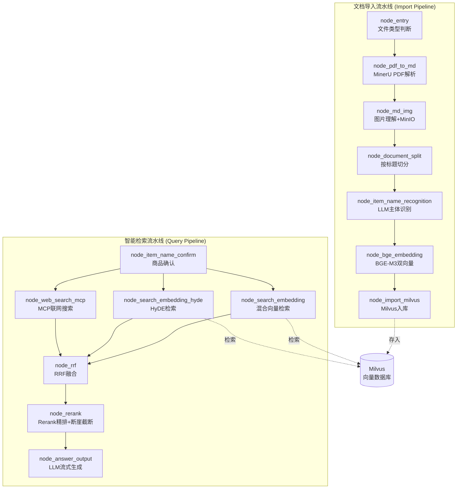

# 掌柜智库 · 企业级 RAG 智能知识库系统

> 基于 **LangGraph + BGE-M3 + Milvus** 的企业级检索增强生成（RAG）系统，支持多格式文档导入、多模态图片理解、混合向量检索、多路召回融合与流式问答。

[](https://www.python.org/)
[](https://langchain-ai.github.io/langgraph/)
[](https://milvus.io/)
[](https://fastapi.tiangolo.com/)
[]()

---

## 一、项目简介

掌柜智库是一个面向垂直领域（产品手册、技术文档、维修指南等）的智能知识库问答系统。它将非结构化文档（PDF / Markdown）通过完整的数据流水线转化为可检索的向量知识，并提供精准的流式问答服务。

系统采用 **LangGraph** 编排两套有状态工作流：

- **文档导入流水线（7 节点）**：PDF 解析 → 图片理解 → 智能切分 → 主体识别 → 双路向量化 → 向量入库
- **智能检索流水线（7 节点）**：意图确认 → 多路召回（向量 / HyDE / 联网）→ RRF 融合 → Rerank 精排 → 流式生成

---

## 二、系统架构



---

## 三、技术栈

| 类别 | 技术 | 说明 |
|------|------|------|
| **工作流引擎** | LangGraph | 有状态图编排，节点/条件边/并行分支 |
| **大语言模型** | DeepSeek (deepseek-chat) | OpenAI 兼容接口，意图理解与答案生成 |
| **视觉语言模型** | 阿里云百炼 qwen-vl-plus | 图片内容摘要生成 |
| **重排序模型** | 阿里云百炼 qwen3-rerank | Cross-Encoder 精排 |
| **向量嵌入** | BGE-M3（本地部署） | 稠密(1024维)+稀疏混合向量 |
| **向量数据库** | Milvus 2.5.5 | 混合检索（稠密+稀疏） |
| **文档数据库** | MongoDB | 多轮对话历史存储 |
| **对象存储** | MinIO | 图片文件存储 |
| **PDF 解析** | MinerU 在线 API | PDF → 结构化 Markdown |
| **Web 框架** | FastAPI + Uvicorn | 异步 HTTP 服务 |
| **实时推送** | SSE | 流式问答（打字机效果） |
| **联网搜索** | 百炼 MCP | Model Context Protocol |

---

## 四、核心特性

### 导入侧
- **MinerU 云端解析**：将复杂排版的 PDF 高精度转换为 Markdown（保留公式、表格、图片）
- **多模态语义对齐**：VL 模型为每张图片生成中文摘要，使图片可被文本检索命中
- **结构化智能切分**：按 Markdown 标题层级切分 + 递归长切短合，保留 `parent_title` 上下文
- **混合向量**：BGE-M3 同时产出稠密向量（语义）与稀疏向量（关键词）
- **幂等入库**：基于 `item_name` 去重，支持重复导入不产生脏数据

### 检索侧
- **多路召回**：向量检索 + HyDE 假设性文档检索 + MCP 联网搜索 三路并行
- **HyDE**：先让 LLM "脑补"假设答案，再用假设答案的向量去检索，提升语义召回
- **RRF 融合**：倒数排名融合算法，无需分数标准化，鼓励多路共识
- **断崖检测动态截断**：根据分数断崖自适应决定 TopK，避免低质量文档混入
- **SSE 流式输出**：逐字推送，前端打字机效果

---

## 五、项目结构

```
knowledge_base/
├── app/
│   ├── core/                      # 核心配置
│   │   ├── logger.py              # 彩色日志
│   │   ├── paths.py               # 路径常量
│   │   ├── lm_config.py           # LLM/VL 配置
│   │   ├── milvus_config.py       # Milvus 配置
│   │   ├── minio_config.py        # MinIO 配置
│   │   ├── embedding_config.py    # BGE-M3 配置
│   │   ├── mineru_config.py       # MinerU 配置
│   │   ├── reranker_config.py     # Reranker 配置
│   │   ├── bailian_mcp_config.py  # 百炼 MCP 配置
│   │   └── load_prompt.py         # 提示词加载
│   ├── import_process/            # 导入流程
│   │   ├── agent/
│   │   │   ├── state.py           # 导入状态定义
│   │   │   ├── node_base.py       # 节点基类
│   │   │   ├── kb_import_workflow.py  # 导入工作流
│   │   │   └── nodes/             # 7 个导入节点
│   │   ├── api/import_service.py  # 导入服务 (port 8000)
│   │   └── page/import.html       # 导入页面
│   ├── query_process/             # 检索流程
│   │   ├── agent/
│   │   │   ├── state.py           # 检索状态定义
│   │   │   ├── node_base.py       # 节点基类
│   │   │   ├── kb_query_workflow.py   # 检索工作流
│   │   │   └── nodes/             # 7 个检索节点
│   │   ├── api/query_service.py   # 查询服务 (port 8001)
│   │   └── page/chat.html         # 聊天页面
│   └── utils/                     # 工具层
│       ├── embedding_utils.py     # BGE-M3 向量生成
│       ├── milvus_utils.py        # Milvus 客户端+混合检索
│       ├── minio_utils.py         # MinIO 客户端
│       ├── llm_utils.py           # LLM 客户端
│       ├── reranker_http_utils.py # Rerank 调用
│       ├── mongo_history_utils.py # 对话历史
│       ├── sse_utils.py           # SSE 推送
│       ├── task_utils.py          # 任务状态追踪
│       ├── rate_limit_utils.py    # 限流
│       └── format_utils.py        # 状态格式化
├── prompts/                       # 提示词模板
├── pyproject.toml
├── .env.example
└── README.md
```

---

## 六、快速开始

### 1. 环境要求

- Python 3.11+
- [uv](https://github.com/astral-sh/uv) 包管理器
- Docker（部署 Milvus / MongoDB / MinIO）

### 2. 启动中间件

```bash
# MinIO
docker run -d --name minio -p 9000:9000 -p 9001:9001 \
    -e "MINIO_ROOT_USER=minioadmin" -e "MINIO_ROOT_PASSWORD=minioadmin" \
    -v ~/volumes/minio/data:/data \
    quay.io/minio/minio:RELEASE.2024-12-18T13-15-44Z server /data --console-address ":9001"

# MongoDB
docker run -d --name mongo --restart always -p 27017:27017 mongo

# Milvus（单机版 + Attu 可视化）
docker compose up -d
```

### 3. 安装依赖

```bash
uv sync
```

### 4. 下载 BGE-M3 模型

```bash
uv run python -c "from modelscope.hub.snapshot_download import snapshot_download; snapshot_download('BAAI/bge-m3', cache_dir='D:/ai_models/modelscope_cache/models')"
```

### 5. 配置环境变量

复制 `.env.example` 为 `.env`，填写：
- `OPENAI_API_KEY`：DeepSeek API Key
- `VL_API_KEY` / `DASHSCOPE_API_KEY`：阿里云百炼 API Key
- `MINERU_API_TOKEN`：MinerU 在线解析 Token
- `MILVUS_URL` / `MONGO_URL` / `MINIO_ENDPOINT`：中间件地址

### 6. 启动服务

```bash
# 导入服务（端口 8000）
uv run python app/import_process/api/import_service.py

# 查询服务（端口 8001）
uv run python app/query_process/api/query_service.py
```

访问：
- 文档导入页：http://localhost:8000/import.html
- 智能问答页：http://localhost:8001/chat.html

---

## 七、API 接口

### 导入服务 (port 8000)

| 方法 | 路径 | 说明 |
|------|------|------|
| POST | `/upload` | 上传 PDF/MD 文件，启动导入 |
| GET | `/status/{task_id}` | 查询导入进度 |
| GET | `/import.html` | 导入页面 |
| GET | `/health` | 健康检查 |

### 查询服务 (port 8001)

| 方法 | 路径 | 说明 |
|------|------|------|
| POST | `/query` | 提交查询（支持流式/非流式） |
| GET | `/stream/{session_id}` | SSE 流式获取结果 |
| GET | `/history/{session_id}` | 获取会话历史 |
| DELETE | `/history/{session_id}` | 清空会话历史 |
| GET | `/chat.html` | 聊天页面 |
| GET | `/health` | 健康检查 |

---

## 八、效果演示

**导入文档**：上传 PDF → 自动解析、图片摘要、切分、向量化、入库，前端实时显示节点进度。

**智能问答**：
```
用户：HAK180烫金机的安全注意事项有哪些？

系统（流式）：
根据参考资料，HAK180烫金机的安全注意事项主要包括以下几个方面：

## 一、设备放置与使用环境
- 本设备必须放置在平稳、水平且稳定的表面上...
- 本设备必须连接到接地良好的电源...

## 二、操作安全
- 请勿将手指放入设备指定区域...
...
```

---

## 九、关键技术实现

### RRF 倒数排名融合
```
RRF_score(d) = Σ weight_i / (k + rank_i(d))
```
多路检索结果按排名融合，k=60 平滑常数保证公平竞争。

### 断崖检测动态截断
根据相邻文档分数的绝对差值和相对差值，自适应决定保留多少条结果，避免固定 TopK 的缺陷。

### 幂等性入库
插入前按 `item_name` 删除旧数据，保证重复导入不产生重复。

---

## 十、License

MIT
